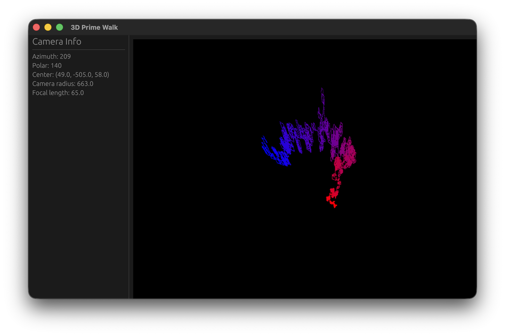
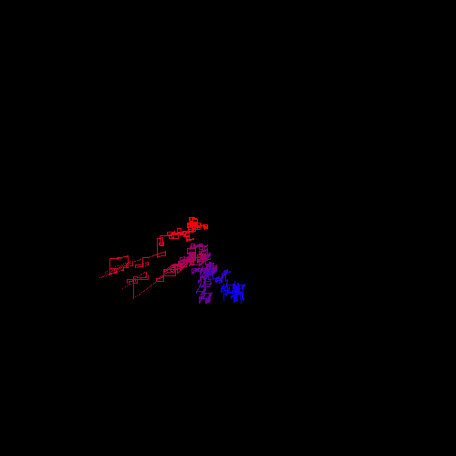
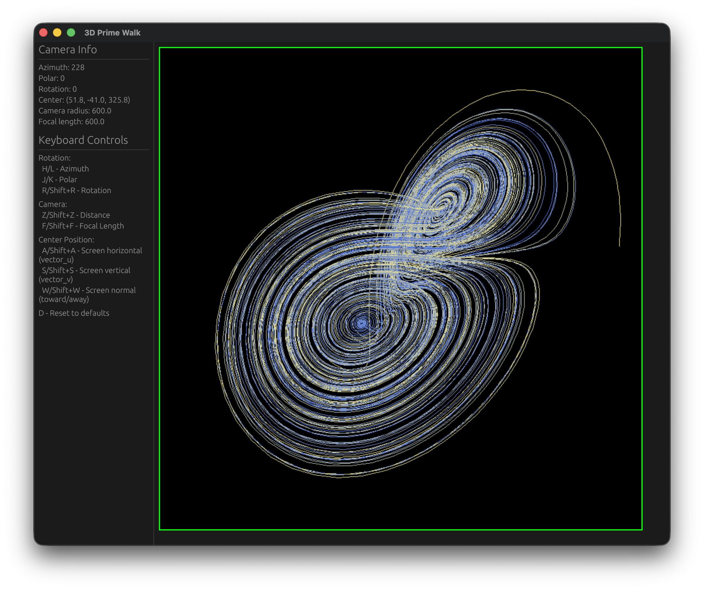

# 3D Prime Walk

`DISCLAIMER: This README is generated by Claude.`

A mesmerizing visualization that creates a walk through three-dimensional space, where the path changes direction at every prime number. The program generates a colorful spiral pattern that reveals the mathematical beauty hidden within the distribution of prime numbers.

## How It Works

The program starts at the origin and begins walking in a single direction through 3D space. With each step, it counts upward from zero. Whenever the step count reaches a prime number (2, 3, 5, 7, 11, 13, ...), the walker changes direction according to a fixed sequence:

1. **Right** (positive X)
2. **Up** (positive Y)
3. **Forward** (positive Z)
4. **Left** (negative X)
5. **Down** (negative Y)
6. **Backward** (negative Z)

After the sixth direction change, the sequence repeats. This creates an intricate three-dimensional path that weaves through space, its turns dictated by the distribution of prime numbers. The resulting structure is both mathematically significant and visually striking.

Each step along the path is colored according to a gradient that transitions from red at the beginning to blue at the end, making it easy to see the progression of the walk and trace how the pattern unfolds over time.

## Visualization





The program projects the 3D walk onto a 2D screen using a sophisticated camera system with proper depth sorting, ensuring that closer points appear in front of more distant ones. The resulting image can be freely manipulated, allowing you to orbit around the structure and examine it from any angle.
75
## Interactive Controls

The visualization is fully interactive, giving you complete control over the camera:

### Rotation
- **H / L** - Rotate horizontally (decrease/increase azimuth)
- **J / K** - Rotate vertically (decrease/increase polar angle)
- **R / Shift+R** - Roll camera (decrease/increase rotation angle)

### Camera Distance
- **Z** - Move camera closer to the structure
- **Shift+Z** - Move camera away from the structure

### Focal Length
- **F** - Decrease focal length (narrower field of view)
- **Shift+F** - Increase focal length (wider field of view)

### Orbit Center
- **A / Shift+A** - Move center point left/right (X axis)
- **S / Shift+S** - Move center point down/up (Y axis)
- **W / Shift+W** - Move center point backward/forward (Z axis)

### Reset
- **D** - Reset all camera values to defaults

The left panel displays real-time information about the camera position, including the current azimuth, polar angle, rotation angle, center point coordinates, camera radius, and focal length.

## Building and Running

This project is written in Rust and requires a Rust toolchain to build.

### Prerequisites
- [Rust](https://www.rust-lang.org/tools/install) (edition 2024 or later)

### Running the Program
```bash
# Run with defaults (25,000 steps, red to blue gradient, prime_walk mode)
cargo run --release

# Run with custom number of steps
cargo run --release -- --steps 10000

# Run with custom gradient colors (format: R,G,B)
cargo run --release -- --start-color 0,255,0 --end-color 255,0,255

# Run with custom walk type
cargo run --release -- --walk-type data_walk

# Combine multiple options (order doesn't matter!)
cargo run --release -- --start-color 255,255,0 --walk-type data_walk

# Using short flags
cargo run --release -- -n 5000 -s 255,0,0 -e 0,255,0 -w prime_walk

# Get help
cargo run --release -- --help
```

The `--release` flag is recommended for optimal performance when rendering the visualization.

#### Command-Line Arguments
All arguments are optional and can be specified in any order:

- **--steps, -n**: Number of steps (default: 25,000)
- **--start-color, -s**: Start color in R,G,B format (default: 255,0,0 - red)
- **--end-color, -e**: End color in R,G,B format (default: 0,0,255 - blue)
- **--walk-type, -w**: Type of walk (default: prime_walk)
  - `prime_walk` - Visualize the distribution of prime numbers in 3D space
  - `data_walk` - Visualize custom coordinate data (requires data file from `data-scripts/`)

Colors must be specified as three comma-separated values between 0-255 (e.g., `255,128,0` for orange).

### Using Data Walk Mode

The `data_walk` option visualizes custom 3D coordinate data instead of prime numbers. To use this mode, you must first generate a data file using one of the Python scripts in the `data-scripts/` folder.

#### Prerequisites for Data Scripts
- Python 3.x

#### Available Data Generators

The `data-scripts/` folder contains three coordinate generators:

**1. Lorenz Attractor** (`generate_lorenz.py`)

Generates the famous chaotic Lorenz attractor pattern:

```bash
cd data-scripts
python3 generate_lorenz.py
cd ..
cargo run --release -- --walk-type data_walk
```



**2. 3D Lissajous Curves** (`generate_lissajous.py`)

Creates beautiful flowing patterns with configurable frequency ratios and phases:

```bash
cd data-scripts

# Default pattern (3:4:5 frequencies)
python3 generate_lissajous.py

# Custom frequency ratio (flowing ribbon pattern)
python3 generate_lissajous.py --a 1 --b 2 --c 3

# Complex woven structure
python3 generate_lissajous.py --a 3 --b 5 --c 7

# Adjust amplitude (size)
python3 generate_lissajous.py --amp 150

# View all options
python3 generate_lissajous.py --help

cd ..
cargo run --release -- --walk-type data_walk
```

**3. Torus Knots** (`generate_torus_knot.py`)

Generates mathematical knots that wrap around a torus:

```bash
cd data-scripts

# Trefoil knot (default)
python3 generate_torus_knot.py

# Cinquefoil knot (5-petaled pattern)
python3 generate_torus_knot.py --p 5 --q 2

# Complex interweaving
python3 generate_torus_knot.py --p 5 --q 3

# Adjust size
python3 generate_torus_knot.py --R 150 --r 80

# View all options
python3 generate_torus_knot.py --help

cd ..
cargo run --release -- --walk-type data_walk
```

All scripts generate a file named `data` in the project root directory, which is read by the program when using `--walk-type data_walk`. You can customize colors and other parameters:

```bash
# Run with custom colors on generated data
cargo run --release -- --walk-type data_walk --start-color 0,255,0 --end-color 255,0,255

# Generate data with custom point count
cd data-scripts
python3 generate_lissajous.py --steps 50000
cd ..
cargo run --release -- --walk-type data_walk
```

## Technical Details

- **Language**: Rust
- **GUI Framework**: eframe/egui
- **Default Steps**: 25,000 (configurable via command-line argument)
- **Rendering Resolution**: 800x800 pixels
- **Default Color Gradient**: Red (255, 0, 0) to Blue (0, 0, 255) (configurable via command-line arguments)

The program uses the Sieve of Eratosthenes algorithm to efficiently generate prime numbers and implements a custom 3D projection system with plane intersection calculations for accurate rendering.

## License

This project is licensed under the MIT License - see the [LICENSE](LICENSE) file for details.

## Author

Benno Richters
